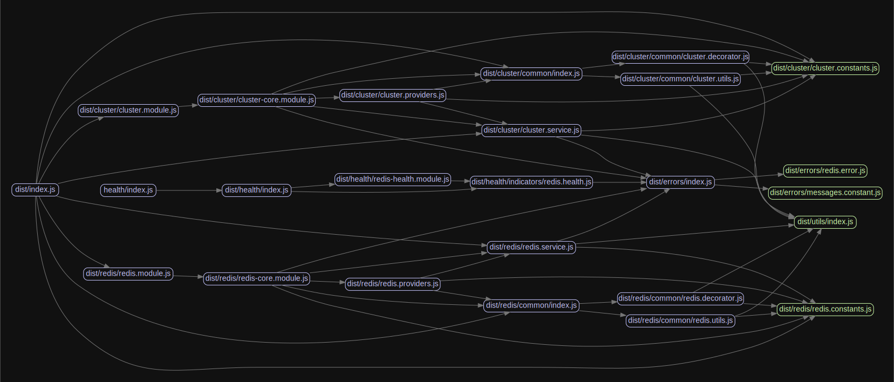

<p align="center">
  <a href="https://nestjs.com/" target="blank"></a>
</p>

<p align="center">Redis(<a href="https://github.com/luin/ioredis" target="blank">ioredis</a>) module for NestJS framework.</p>

[](https://www.npmjs.com/package/@liaoliaots/nestjs-redis)
[](https://github.com/liaoliaots/nestjs-redis/blob/main/LICENSE)


[](https://www.codefactor.io/repository/github/liaoliaots/nestjs-redis)

<p align="center">
<a href="https://github.com/liaoliaots/nestjs-redis/actions/workflows/release.yml">

</a>
</p>

## Features 🚀

-   Support **redis** and **cluster**
-   Support health check
-   Specify multiple clients
-   Easy to test
-   Inject a redis/cluster client via `@InjectRedis()` and `@InjectCluster()` decorator
-   Get a redis/cluster client via `RedisManager` and `ClusterManager`

## Documentation

_For the legacy V2 or V3@next documentation, [click here](docs/v2/README.md)._

-   [Test coverage](#test-coverage)
-   [Install](#install)
-   [Redis](docs/v3/redis.md)
-   [Cluster](docs/v3/cluster.md)
-   [Health Checks](docs/v3/health-checks.md)
-   [Examples](docs/v3/examples.md)
    -   [Redis](docs/v3/examples.md#redis)
        -   [Default](docs/v3/examples.md#default)
        -   [Sentinel](docs/v3/examples.md#sentinel)
    -   [Cluster](docs/v3/examples.md#cluster)
        -   [Multiple Clients](docs/v3/examples.md#multiple-clients)
-   [Test a class](#test-a-class)
-   [Package dependency overview](#package-dependency-overview)

## Test coverage

| Statements                                                                                      | Branches                                                                                    | Functions                                                                                     | Lines                                                                                 |
| ----------------------------------------------------------------------------------------------- | ------------------------------------------------------------------------------------------- | --------------------------------------------------------------------------------------------- | ------------------------------------------------------------------------------------- |
|  |  |  |  |

## Install

### NestJS 8:

```sh
$ npm install --save @liaoliaots/nestjs-redis ioredis
$ npm install --save-dev @types/ioredis
```

```sh
$ yarn add @liaoliaots/nestjs-redis ioredis
$ yarn add --dev @types/ioredis
```

### NestJS 7:

```sh
$ npm install --save @liaoliaots/nestjs-redis@2 ioredis @nestjs/terminus@7
$ npm install --save-dev @types/ioredis
```

```sh
$ yarn add @liaoliaots/nestjs-redis@2 ioredis @nestjs/terminus@7
$ yarn add --dev @types/ioredis
```

## Test a class

This package exports `getRedisToken()` and `getClusterToken()` functions that return an internal injection token based on the provided context. Using this token, you can provide a mock implementation of the redis/cluster client using any of the standard custom provider techniques, including `useClass`, `useValue`, and `useFactory`.

```TypeScript
const module: TestingModule = await Test.createTestingModule({
    providers: [{ provide: getRedisToken('your namespace'), useValue: mockClient }, YourService]
}).compile();
```

A working example is available [here](sample/01-testing-inject).

## Package dependency overview



## Author

👤 **LiaoLiao**

-   Github: [@liaoliaots](https://github.com/liaoliaots)

## 🤝 Contributing

Contributions, issues and feature requests are welcome!<br />Feel free to check [issues page](https://github.com/liaoliaots/nestjs-redis/issues).

## Show your support

Give a ⭐️ if this project helped you!

## 📝 License

Copyright © 2021 [LiaoLiao](https://github.com/liaoliaots).<br />
This project is [MIT](https://github.com/liaoliaots/nestjs-redis/blob/main/LICENSE) licensed.
